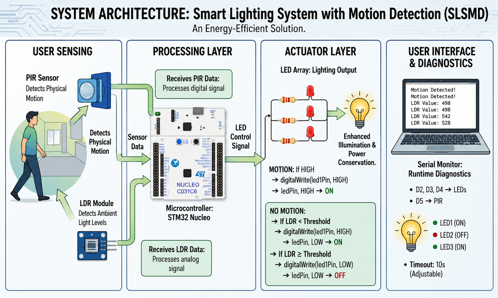

```markdown
# 💡 Smart Lighting System with Motion Detection (SLSMD)

<p align="center">
  
</p>

An intelligent and energy-efficient lighting system built using the **STM32 Nucleo** development board. The system automatically controls lighting based on **motion detection** and **ambient light intensity**, helping reduce unnecessary power consumption while improving user convenience.

---

## 📌 Project Overview

The **Smart Lighting System with Motion Detection (SLSMD)** is an embedded systems project that combines a **Passive Infrared (PIR) Sensor**, **Light Dependent Resistor (LDR)**, and **STM32 Nucleo** microcontroller to automate lighting.

The system continuously monitors:

- Human motion using a PIR sensor
- Ambient light intensity using an LDR

The LEDs are turned **ON** when:

- Motion is detected, or
- The surrounding environment is dark.

Otherwise, the LEDs remain **OFF**, ensuring efficient energy utilization.

---

## ✨ Features

- Motion-based automatic lighting
- Ambient light detection using LDR
- Energy-efficient operation
- Automatic LED control
- Real-time monitoring through Serial Monitor
- Simple and modular embedded system design

---

## 🛠 Hardware Components

- STM32 Nucleo Board
- PIR Motion Sensor
- LDR (Light Dependent Resistor)
- LEDs (3)
- Current Limiting Resistors
- Breadboard
- Jumper Wires
- USB Cable

---

## 💻 Software Used

- STM32 Arduino Core
- Arduino IDE
- Serial Monitor

---

## 🧠 Program Logic

The system prioritizes **motion detection**.

- If motion is detected:
  - All LEDs are switched **ON**.
- Otherwise:
  - The LDR value is evaluated.
  - Low light → LEDs **ON**
  - Bright light → LEDs **OFF**

This approach ensures that lighting is only active when required, reducing unnecessary power consumption.
```
